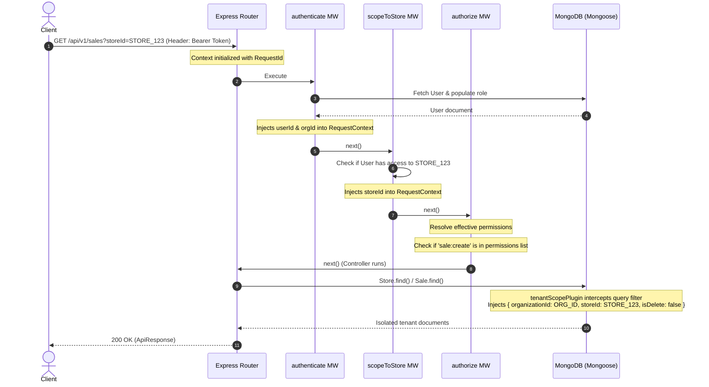

# SyncSale POS Backend - Development History & Architecture Log

This document tracks the initial setup phase, completed features, structural decisions, and configuration standards established in the codebase so far.

---

## 📅 Project Setup & Configuration

- **TypeScript Foundation:** Initialized typescript compiler using standard strict settings (`tsconfig.json`) targeting `ES2022` with CommonJS module generation.
- **Path Aliasing:** Configured `@/*` mapped to `src/*` to avoid deeply nested relative imports (e.g., `import X from "../../../utils"`).
- **Formatters and Linters:** Configured ESLint (`eslint.config.mts`) and Prettier (`.prettierrc`, `.prettierignore`) for codebase consistency.

---

## ⚙️ Environment Configuration (`src/config/env.config.ts`)

- **Strict Validation (Zod):** Implemented schema-based validation for all incoming `process.env` properties. The server will fail to startup and output detailed error logs if variables are missing or misconfigured.
- **Dynamic Loading:** Loads environment files based on the active `NODE_ENV`:
  - `test` ➡️ `.env.test.local`
  - `development` ➡️ `.env.development.local`
  - `production` ➡️ `.env`
- **Key Parameters Validated:**
  - `PORT`, `NODE_ENV` (Enforced enum: development/production/test)
  - `MONGO_URI` (Must be a valid URL format)
  - `JWT_ACCESS_SECRET` & `JWT_REFRESH_SECRET` (Strict minimum length of 32 characters enforced; must be different secrets)
  - `CORS_ORIGIN`, `API_VERSION`
  - Feature Flags (`FEATURE_MULTI_CURRENCY`, `FEATURE_ADVANCED_TAX_RULES`)
  - Logging level (`LOG_LEVEL`, `LOG_TO_FILE`)

---

## 🗄️ Database Layer (`src/config/db.config.ts` & `src/models/`)

- **Mongoose MongoDB Connection:**
  - Configured listeners on the connection pool (`connected`, `error`, `disconnected`).
  - Connection options tailored for POS environments: `autoIndex: false` in production (prevents latency spikes due to index rebuilds), `serverSelectionTimeoutMS: 5000` (fail fast if DB is down), and `socketTimeoutMS: 45000` (keeps sockets alive).
- **User Model (`src/models/user.model.ts`):**
  - **Roles Enum (`UserRole`):** Defines `SUPER_ADMIN`, `STORE_ADMIN`, `MANAGER`, `CASHIER`, `INVENTORY_MANAGER`, and `ACCOUNTANT`.
  - **PIN Password Format:** Custom Mongoose validation enforces numeric-only passwords (PIN style) for `SUPER_ADMIN` and `STORE_ADMIN` roles, while allowing standard passwords for cashiers/managers.
  - **Security Hooks:** Pre-save middleware automatically hashes passwords using `bcryptjs`.
  - **JWT Generation Instance Methods:**
    - `generateAccessToken()`: Encodes `id`, `email`, `role`, and `storeId` (for multi-tenant scoping if not SUPER_ADMIN).
    - `generateRefreshToken()`: Encodes user `id` for session renewal.
  - **Output Scoping:** Automatic JSON serialization transform strips sensitive fields like `password` and `__v` from results.

---

## 🪵 Structured Logging & Context Correlation

- **Correlation ID Middleware (`src/middleware/requestId.middleware.ts`):**
  - Generates or forwards a unique `X-Request-Id` UUID for each incoming request.
  - Stores this ID inside a Node `AsyncLocalStorage` context block (`src/utils/requestContext.ts`).
- **Winston Custom Logger (`src/config/logger.config.ts`):**
  - Reads active request contexts dynamically and injects the `requestId` into all Winston metadata logs.
  - **Development Mode:** Outputs human-readable, colorized terminal logs detailing timestamp, log level, request ID (if active), messages, and stack traces.
  - **Production Mode:** Outputs structured single-line JSON logs to feed aggregation tools (like Datadog/ELK).
  - **File Rotation Logging:** If `LOG_TO_FILE=true`, records `combined.log` (10MB limit) and `error.log` (5MB limit) in the local `/logs` directory, retaining the 5 most recent files.
- **Morgan HTTP Traffic Logger (`src/middleware/requestLogger.middleware.ts`):**
  - Intercepts incoming HTTP requests and pipes access descriptions (method, path, status code, response time) directly through Winston.

---

## 🛡️ Security & Route Architecture (`src/app.ts`)

- **HTTP Protection:** Embedded **Helmet** to block common injection vectors by configuring security headers.
- **CORS Config:** Configured dynamic origin mapping checking against the validated environment origins.
- **Payload Limits:** Restricted JSON and urlencoded body parsers to `10mb` max limits to prevent buffer overload DoS attacks.
- **Barrel Routing Structure:** Versioned endpoint management via `src/routes/v1/index.ts`.
- **Infrastructure Health Checks:** A non-versioned, lightweight `/health` route reporting uptime, environment, and system diagnostics for monitors/load balancers.

---

## ⚠️ Centralized Error Handling (`src/middleware/errorHandler.middleware.ts`)

- **Standardized Utilities (`src/utils/`):**
  - `ApiError`: Extends base Error to track HTTP status codes, validation errors, and custom messages.
  - `ApiResponse`: Utility for wrapping JSON payloads consistently (`statusCode`, `data`, `message`, `success`).
  - `asyncHandler`: Eliminates boilerplated `try/catch` wrappers around Express controllers.
- **Failsafe Global Handler:**
  - Catches route failures, JSON parsing crashes, mongoose cast/validation issues, and duplicate key errors.
  - Sanitizes stack trace information so development details are not leaked in production mode.

---

## 🔑 Dynamic RBAC & Multi-Tenancy Architecture

We transitioned the backend from basic static role enumerations to a **Dynamic RBAC (Role-Based Access Control) & Multi-Tenant SaaS** design. This allows tenants (Organizations) to define, configure, and modify their own roles and permissions dynamically without changing code.

### 1. Architecture & Design Decisions
- **Static Vocabulary:** Action permissions (e.g., `sale:create`, `product:delete`) are defined in code as a fixed permission catalog. Developers write checks against these keys.
- **Dynamic Configuration:** Roles are stored in the database. Their scopes and permissions arrays can be edited per organization dynamically.
- **Tenant Separation:** Core data isolation ensures data cannot leak between tenants (Organizations) and sub-tenants (Stores) automatically.

---

### 2. Component-by-Component Walkthrough

#### 📂 Part 1: The Permission Catalog (`permissions.catalog.ts`)
Defines the absolute vocabulary of actions inside the platform.
- **PermissionKey:** Union type of all valid system operations.
- **PermissionDefinition:** Structured catalog with category-scoped keys:
  - **Sales:** `sale:create`, `sale:void`, `sale:refund`
  - **Catalog:** `product:create`, `product:read`, `product:update`, `product:delete`
  - **Inventory:** `inventory:adjust`, `inventory:transfer`
  - **Reports:** `report:view_store`, `report:view_org`
  - **Admin:** `user:invite`, `user:manage_roles`, `role:manage`, `store:create`, `store:configure`, `organization:configure`
- **Type Guard:** `isValidPermission(key: string): key is PermissionKey` is exported to reject invalid permissions at the database validation layer.

#### 📂 Part 2: Database Models (with Tenant Scoping & Soft Delete)

- **Organization Model (`organization.model.ts`):**
  - Represents a corporate tenant.
  - Features a unique lowercase `slug` (indexed for subdomain routing), validation for `contactEmail`, tenant status control (`isActive`), and settings configuration (e.g., default currency, timezone).
- **Store Model (`store.model.ts`):**
  - Represents physical store locations under an Organization.
  - References `organizationId` and holds fields like `code` (e.g., `STR-001`), `address`, and `timezone`.
  - Implements a compound unique index on `{ organizationId: 1, code: 1 }` ensuring store codes are unique per organization, while letting different tenants reuse codes.
- **Role Model (`role.model.ts`):**
  - Stores dynamic permissions arrays.
  - References `organizationId` (nullable for platform-wide roles).
  - Scope options: `platform`, `organization`, or `store`.
  - Protects system defaults from deletion via `isSystemRole` flag.
  - Implements a compound unique index on `{ organizationId: 1, slug: 1 }` to guarantee unique roles within the tenant workspace.
- **User Model (`user.model.ts`):**
  - References `organizationId` with a scoped unique index on `{ organizationId: 1, email: 1 }` allowing users to reuse their emails across different organizations.
  - Keeps credentials secure by marking `passwordHash` as `select: false`.
  - Maps to an organization role (`orgRoleId`) and an array of store-specific roles (`storeAccess: Array<{ storeId, roleId }>`).
  - Stores SHA-256 hashes of `refreshTokens` (with IP & UserAgent) to secure refresh flows at rest.
  - Includes a platform operator flag `isSuperAdmin` to bypass RBAC checks entirely.

#### 📂 Part 3: Tenant Scoping & Soft Delete Plugin (`tenantScope.plugin.ts`)
Serves as an automatic defense-in-depth isolation boundary at the database driver level.
- **Auto-Injection:** Injects `isDelete`, `organizationId`, and `storeId` schema paths dynamically.
- **Scoping Hooks:** Intercepts Mongoose query methods (like `find`, `findOne`, `countDocuments`, `update`, `delete`).
- **Context Enforcer:** Reads tenant IDs from `AsyncLocalStorage` and automatically overlays them on active queries.
- **Soft Delete filter:** Automatically appends `{ isDelete: { $ne: true } }` unless explicitly overridden.
- **Migration/Seed Bypass:** Disables filters gracefully if request context is unavailable (e.g., during startup seed runs).

#### 📂 Part 4: Token Authentication Service (`auth.service.ts`)
- **generateAccessToken(payload):** Signs short-lived access JWTs containing `userId`, `organizationId`, and `isSuperAdmin`.
- **generateRefreshToken():** Generates cryptographically secure, opaque random tokens, returning the raw token to the client and storing a secure SHA-256 hash in the database.
- **verifyAccessToken(token):** Verifies access token signatures and throws standard 401 `ApiError` instances on expired or malformed tokens.

#### 📂 Part 5: Effective Permissions Resolution (`permission.service.ts`)
- **getEffectivePermissions(user, storeId):** Computes the union of org-level permissions and active store-level permissions based on request context. Returns `['*']` for Super Admins.
- **canGrantRole(grantorPerms, grantorScope, targetRole):** Prevents privilege escalation. Grantors cannot create or assign roles with higher scopes, or assign permissions they do not possess.

#### 📂 Part 6: Authorization Middleware Chain (`rbac.middleware.ts`)
- **authenticate:** Resolves `Authorization` headers, verifies access, and binds `userId`/`organizationId` in AsyncLocalStorage.
- **scopeToStore:** Resolves `storeId` from parameters, body, or query. Verifies user access, then injects `storeId` into the active context.
- **authorize(permission):** Evaluates dynamic permissions against the current user/store context, checking for either exact permission key matches or the wildcard (`*`) bypass.

#### 📂 Part 7: Default Roles Provisioning (`roleSeed.service.ts`)
Seeds default templates automatically on tenant creation:
- `org_admin`: All organization and store-level scopes.
- `store_manager`: Sales, inventory adjustment, and catalog management.
- `cashier`: Basic checkout (`sale:create`, `product:read`, `report:view_store`).
- `accountant`: Organizational finances (`report:view_org`, `sale:refund`).
- `inventory_clerk`: Catalog reading and inventory adjustments.

---

### 3. How Multi-Tenant Context Flows
The sequence diagram below displays how the authentication, context bindings, and database drivers interact when a request is made:



---

### 4. Linting and Type Safety Adjustments
We eliminated the use of the `any` keyword in the implementation by:
1. **Namespace Merging (`types/express.d.ts`):** Extended the Express Request interface to merge type-safe `user?: UserDocument` and context keys.
2. **Error Narrowing:** Refactored catches to type-check `error instanceof Error` before accessing properties.
3. **Mongoose Populated Casts:** Handled populated schema fields using safe narrowing checks (e.g., `'scope' in orgRole` property guard) instead of casting as `any`.

---

## 👑 Platform-Level Super Admin Authentication System

We implemented a secure, end-to-end Super Admin Authentication System designed to manage platform-level administrators separately from tenant-level users (like managers, cashiers, and org admins). This guarantees platform operators can manage the system globally without contaminating multi-tenant data boundaries.

### 1. Database Schema & Data Layer Security (`src/models/user.model.ts`)
We established strict boundary layers directly in the database:
- **Conditional Organization Scoping:** Super Admins span all organizations. We updated the `IUser` interface to support a `null` `organizationId` and configured a conditional validation function in Mongoose:
  ```typescript
  organizationId: {
    type: Schema.Types.ObjectId,
    ref: "Organization",
    required: function (this: any) {
      return !this.isSuperAdmin; // Only required for tenant accounts
    }
  }
  ```
- **Tenant Exclusivity Hook (Defense-in-Depth):** Added a schema-level `pre("validate")` hook that rejects saving user documents if both `isSuperAdmin: true` and `organizationId` are present. This prevents tenant-to-platform privilege escalation.
- **Partial Compound Indexing Strategy:**
  - MongoDB's default compound unique index on `{ organizationId: 1, email: 1 }` fails when multiple users have a `null` organizationId (since only one document can have a null value).
  - Reconfigured this to a partial index: `{ organizationId: 1, email: 1 }` filtered to `{ organizationId: { $gt: null } }`. This ignores platform accounts.
  - Added a second partial index: `{ email: 1 }` filtered to `{ isSuperAdmin: true }` to ensure all Super Admin email addresses are globally unique across the platform.

---

### 2. Strong Cryptographic Boundaries (JWT & Secrets)
To prevent cross-tenant key-compromise attacks (where a compromised tenant key might be used to sign a platform token), configurations are strictly isolated in `src/config/env.config.ts`:
- **Isolate JWT Platform Secret:** Signs and verifies Super Admin tokens exclusively using `JWT_PLATFORM_SECRET`. We added strict refinements checking that this platform secret does not match the tenant access or refresh secrets.
- **Tighter Expiry Configurations:** Platform tokens carry higher privilege, requiring shorter lifetimes:
  - Access Token expiry: `10m` (vs tenant `15m`).
  - Refresh Token expiry: `3d` (vs tenant `7d`).
- **Audience Claim Guard:** Super Admin access tokens are signed with the audience claim `{ aud: 'platform' }`. The platform verifier strictly asserts `aud === 'platform'`, ensuring tenant JWTs are rejected on platform routes.

---

### 3. Factorization of Shared Cryptography (`src/utils/token.util.ts`)
To keep our code DRY (Don't Repeat Yourself), we extracted cryptographic and helper logic from the existing tenant service into a unified utility file:
- `generateOpaqueToken()`: Generates a 40-byte hex-random plaintext token and returns both the plain string (for the client) and its SHA-256 hashed representation (for database storage).
- `hashToken()`: Reusable helper for SHA-256 token hashing.
- `getExpiryDate()`: Parses human-friendly time periods (e.g. `3d`, `10m`) into native JavaScript Date objects.
- Refactored the original `auth.service.ts` to consume these shared utilities, ensuring clean and reusable patterns.

---

### 4. Platform Authentication Middleware (`src/middleware/platformAuth.middleware.ts`)
Created a dedicated middleware for Super Admin authentication that operates in complete isolation from the tenant RBAC:
- Extracts and verifies bearer tokens using the platform secret (`JWT_PLATFORM_SECRET`).
- Re-validates the database state (`isSuperAdmin === true` and `isActive === true`) to catch real-time account deactivations.
- Binds user details to the request (`req.user`) and registers `userId` in the thread-safe `AsyncLocalStorage` Request Context.

---

### 5. Platform Controller, Validation & Routes
Built the controller layer (`src/controllers/platformAuth.controller.ts`) to manage authentication endpoints:
- **Anti-User Enumeration Login:** If a login fails, the controller catches the failure, logs the detailed breakdown internally via Winston, and returns a generic `401 Invalid credentials` to the client. This prevents attackers from finding valid admin emails by analyzing response differences.
- **Refresh Token Rotation (RTR):** Enforces single-use refresh tokens. When a session is refreshed, the old refresh token is revoked and a new pair is issued. Contains code documentation detailing how to handle token reuse attacks (terminating all active sessions if a previously-used token is presented again).
- **Logout Mechanics:** Supports logging out of a single device (by matching and removing the hashed token) or purging the entire `refreshTokens` subdocument array to log out of all devices.
- **Namespaced API:** Mounted the routes under `/api/v1/platform/auth/...` so it is isolated and clearly identifiable in routing trees.

---

### 6. CLI-Only Seeding Pathway (`src/scripts/seedSuperAdmin.ts`)
To enforce that Super Admin accounts are never created via public HTTP endpoints, we built a secure database initialization CLI script:
- Invoked via `npm run seed:super-admin`.
- Parses arguments (`--email`, `--password`), checks environment variables as a fallback, and uses interactive terminal prompting if variables are missing.
- Runs input checks against Zod schemas and saves the new administrator document directly to the database.

---

### 7. End-to-End Verification
- **Compilation & Formatting Check:** Ensured strict type compliance and verified linting rules.
- **Integration Test Suite (`testSuperAdminAuth.ts`):** Built a self-contained integration test environment starting a mock server on port `3999`. Runs 7 test cases covering:
  1. Successful Super Admin Login
  2. Input Validation Failure (Invalid email)
  3. Incorrect Password Attempt
  4. Access Token verification (Audience guard validation)
  5. Session Refresh rotation and RTR
  6. Logout (Session invalidation)
  7. Tenant Token rejection on Platform route
  All tests pass successfully.

---

## 🏢 Tenant Onboarding, User Invitations & Transactional Signup

We implemented a robust and secure **Multi-Tenant Onboarding System** featuring atomic organization signups, invite-based user registration with strict privilege escalations control, and safe transactional database operations.

### 1. Database Schema & Model Enhancements (`src/models/user.model.ts`)
To accommodate an invitation flow without violating schema constraints (since invited users do not have a password or active status at the time of creation), we updated the User schema:
- **Invitation Tracking Fields:**
  - `inviteToken`: Hashed (SHA-256) opaque token, marked `select: false` to prevent accidental database leakage.
  - `inviteTokenExpiresAt`: Timestamp representing invite validity.
  - `inviteStatus`: Enum with values `'pending'` | `'accepted'`, defaulting to `'accepted'` (since self-registering organization admins are immediately active and accepted).
- **Conditional Password Requirement:** Modified the `passwordHash` field to be required only when the invitation is accepted:
  ```typescript
  passwordHash: {
    type: String,
    required: function (this: any) {
      return this.inviteStatus !== "pending";
    },
    select: false,
  }
  ```
- **Safe Password Comparison:** Refactored the `comparePassword()` instance method to return `false` gracefully if the user has no password set (e.g. pending invited users) rather than raising internal server exceptions:
  ```typescript
  userSchema.methods.comparePassword = async function (candidatePassword: string): Promise<boolean> {
    if (!this.isSelected("passwordHash")) {
      throw new Error("Password hash not loaded. Please select passwordHash...");
    }
    if (!this.passwordHash) {
      return false; // Safely return false if user has no password set (e.g., pending invitee)
    }
    return bcrypt.compare(candidatePassword, this.passwordHash);
  };
  ```

---

### 2. Transactional Tenant Onboarding (`src/services/organizationSignup.service.ts`)
Signing up a new tenant involves modifying multiple Mongoose collections (`organizations`, `roles`, and `users`). To prevent orphaned records in case of partial failures, we implemented these steps inside a **Mongoose session transaction**:
- **Slugification & Collision Handler:** Automatically generates a clean, lowercase URL slug from the organization name. If a collision is detected in the database, a fallback loop appends a 4-character random alphanumeric suffix and retries up to 10 times.
- **Transactional Role Seeding:** Integrated `seedDefaultRolesForOrganization` inside the session context, ensuring the default tenant roles (such as `org_admin`, `store_manager`, `cashier`) are provisioned within the transactional boundary.
- **Immediate Admin Bindings:** Binds the initial tenant user to the newly seeded `org_admin` role.
- **Atomic Operations:** If any database write fails during role seeding, user creation, or organization creation, the transaction rolls back, keeping the database in a clean state. On success, the transaction commits. *(Superseded: signup no longer issues tokens. The organization is created as `pending` and must be approved by a Super Admin; see "Gated Organization Onboarding" below.)*

---

### 3. Invite-based User Onboarding (`src/services/userInvite.service.ts`)
Manages the lifecycle of user invitations and prevents privilege escalations:
- **Enforcing the Privilege Ceiling:** Before creating an invite, the system verifies that the inviter's scope rank and permission keys are superior to or equal to the target role. A user with `store_manager` privileges cannot invite an `org_admin`, nor can any user assign a role that possesses permissions they do not have themselves.
- **Hashed Opaque Invitations:** Reuses the opaque token design. A cryptographically secure 40-byte plaintext hex token is generated for the email URL, while the SHA-256 hash is stored in the database.
- **Scope Scoping Assignment:**
  - For `'organization'` scoped roles, the role ID is assigned directly to `orgRoleId`.
  - For `'store'` scoped roles, the configuration pushes a binding into the `storeAccess` array (validating that `storeId` is provided).
- **Auto-Login on Accept:** When accepting an invitation, the token is verified, the user sets their password (triggering Mongoose's pre-save hashing hook), the account status turns active, and the invite status becomes `'accepted'`. The system immediately returns the access and refresh tokens.

---

### 4. Controller & Route Configurations
- **Anti-Enumeration Login:** Refactored tenant auth login endpoints. If the slug, email, or password comparison fails, the system responds with a generic `401 Invalid credentials` to block brute-force scanners from mapping active accounts. Status checks (e.g. `isActive`) are executed only after password validation.
- **Dynamic Permission Resolution (`/me`):** Built the `/me` routing endpoint. It resolves the user's active permissions context. If a `storeId` query parameter is passed, the service aggregates the user's store-specific permissions (e.g., cashier operations) alongside their organization-wide permissions.

---

### 5. Strict TypeScript & ESLint Compliance
Refactored operations to ensure clean compilations without bypassing type checks:
- **Eliminated Explicit Any:** Cleaned up type assertions, typing request payloads with strict interfaces.
- **ES6 Object Destructuring over Delete Operands:** The JavaScript `delete` operator is unsafe and discouraged in strict TypeScript setups. Instead, we sanitize database documents using object destructuring:
  ```typescript
  const { passwordHash: _passwordHash, refreshTokens: _refreshTokens, ...userResponse } = user.toObject();
  ```
  Unused outputs are prefixed with an underscore (`_`), complying with the ESLint rules for unused variables.

---

### 6. Programmatic Verification (`src/scripts/verifyTenantFlow.ts`)
We created a verification script in the development environment to prove the integrity of the onboarding systems:
- Verifies that organization signups are fully atomic and yield valid auth tokens.
- Asserts that invitations register users with `isActive: false` and no passwords.
- Validates that accepting the invite activates the account, registers the password hash, and logs the user in.
- Asserts that a `store_manager` trying to invite an `org_admin` is intercepted and throws a `403 Access Denied` error.

---

## 🚦 Gated Organization Onboarding (Sales-Assisted Approval)

Organization signup no longer grants immediate access. New organizations are created as `pending` and can only authenticate after a Super Admin approves them.

### 1. Signup Request (`POST /api/v1/auth/signup`)
- **Body:** `organizationName`, `contactPhone` (required), `contactEmail` (optional), `adminFirstName`, `adminLastName`, `adminEmail`, `adminPassword`.
- **`contactPhone`:** New required field on the Organization model. Accepts 7-20 characters: optional leading `+`, digits, spaces, `-` and `()`.
- **`contactEmail`:** Optional. When omitted, it falls back to `adminEmail`.
- **No tokens issued:** The response is `201` with `{ organization: { id, name, slug, approvalStatus } }`.

### 2. Duplicate Application Protection (`organizationSignup.service.ts`)
Duplicates are keyed on `adminEmail` (names collide between unrelated businesses):
- **Pre-check:** Rejects with `409` if the admin email belongs to a user in an organization that is `pending` or `approved`. Rejected and soft-deleted organizations are ignored.
- **Database-level guarantee:** `applicantEmail` (denormalized copy of the admin email) has a partial unique index limited to `approvalStatus: "pending"`, so two simultaneous signups cannot both pass the pre-check. A duplicate-key error maps to `409`.
- **Transient conflict retry:** The public `signupOrganization` wraps the transactional `signupOrganizationOnce` and retries up to 4 times on `TransientTransactionError`.

### 3. Approval State on the Organization Model
- `approvalStatus`: `pending` (default) | `approved` | `rejected`, orthogonal to `isActive` (which still means post-approval suspension).
- Audit fields: `approvedBy`, `approvedAt`, `rejectedBy`, `rejectedAt`, `rejectionReason`.
- Roles are seeded at signup (not approval), so pending and rejected organizations already have their default roles.

### 4. Super Admin Review API (`/api/v1/platform/organizations`, Super Admin token required)
Files: `platformOrganization.routes.ts`, `.controller.ts`, `.service.ts`, `platformOrganization.validator.ts`.

| Endpoint | Behavior |
|---|---|
| `GET /` | Paginated list, optional `?status=`, `page`, `limit` (max 100) |
| `GET /:id` | Full detail of one application |
| `POST /:id/approve` | Optional body `{ slug }` to correct the slug. `400` if already approved. `409` if the same applicant has another pending/approved organization or the slug is taken. Clears prior rejection fields. |
| `POST /:id/reject` | Body `{ reason }` (5-500 chars). Only `pending` organizations can be rejected (atomic conditional update); otherwise `400`. Use `isActive` to suspend a live organization. |

Approve and reject are logged through Winston. TODO: dedicated audit log collection and applicant email notification.

### 5. Login Enforcement (`tenantAuth.controller.ts`)
After the password is verified (to preserve anti-enumeration), login returns `403` for `pending` ("still pending review"), `rejected` ("not approved"), suspended organizations and deactivated users. Per the review notes in the reject service, `authenticate` also re-checks `approvalStatus` on each request.

### 6. Flow Summary
```
signup -> pending --approve--> approved --(isActive=false)--> suspended
             |
             +--reject--> rejected --approve (re-review)--> approved
```

### 7. Known Gaps / Next Steps
- No re-apply path for rejected organizations (the applicant can sign up again; a dedicated flow is planned).
- No applicant notification (needs an email service), so the Super Admin must communicate the slug and decision out of band.
- No immutable audit log collection.

### 8. Token Lifetimes (for reference)
| Token | Tenant users | Super Admin |
|---|---|---|
| Access | 15m (`JWT_ACCESS_EXPIRY`) | 10m (`JWT_PLATFORM_ACCESS_EXPIRY`) |
| Refresh (rotating) | 7d (`JWT_REFRESH_EXPIRY`) | 3d (`JWT_PLATFORM_REFRESH_EXPIRY`) |

---

## 👥 Staff Management (Phase 0 + Phase 1)

Before this work an organization admin could create Store B but had no way to staff it: the only
endpoints under `/users` were "send invite" and "accept invite". There was no way to list staff,
assign an existing employee to another store, change anyone's role, or — critically — **turn off
a departing employee**. `user.isActive` was enforced in `authenticate` and on refresh, but nothing
in the API could ever set it to `false`.

Identity was settled before the POS domain deliberately: sales and inventory records will carry
`createdBy`/`storeId`, and once a ledger references users the assignment model is expensive to
change.

### Phase 0 — Foundations

**1. New permissions (`permissions.catalog.ts`)**
`user:read` (view the roster) and `user:manage` (activate/deactivate). Reusing `user:invite` as
the gate for reading staff would have been semantic drift. `user:invite` and `user:read` are now
`minScope: "store"`, and `store_manager` holds both: a store manager hiring a cashier for their
own store is normal retail, and the privilege ceiling still stops them granting anything above
themselves.

**2. System role reconcile (`syncSystemRolePermissions`)**
`seedDefaultRolesForOrganization` is idempotent *by slug* — an existing role is skipped entirely,
permissions untouched. So adding a catalog key never reached organizations seeded earlier, and
their `org_admin` would silently 403 on any endpoint guarding the new key. The reconcile unions in
missing template permissions and is **additive, never subtractive**, so an organization's own
customizations survive. Run `npm run sync:system-roles` after every catalog change.

**3. Tenant scoping on `User` and `Role`**
Neither model used `tenantScopePlugin`; every user query was hand-written with an explicit
`organizationId` filter. With `GET /users/:userId` added, one forgotten `User.findById` would have
been a cross-tenant read of another organization's employee record. The plugin adds no fields
here (both schemas already define `organizationId` and `isDelete`) — only the pre-query hooks.
Safe for the unauthenticated paths: login, refresh, accept-invite and platform auth all run with
no organization in the request context, and `authenticate` sets the context only *after* its own
lookup. Services still pass `organizationId` explicitly; the plugin is the backstop.

**4. `canManageUser` (`permission.service.ts`)**
`canGrantRole` answers "may you hand out this role" — it inspects only the role being assigned, so
on its own it would let a store manager with `user:manage_roles` deactivate the organization admin
(deactivation assigns no role). `canManageUser` adds the missing half: the actor must already hold
every privilege the target holds, across their organization role **and** every store role.

**5. `storeAccess` integrity**
Nothing stopped two entries for the same store, and `getEffectivePermissions` resolves a store
role with `Array.prototype.find` — so whether someone was a cashier or a manager depended on array
insertion order. A `pre("validate")` hook now enforces one role per store. Added the two indexes
the new queries need: `{ organizationId, "storeAccess.storeId" }` and `{ organizationId, orgRoleId }`.

### Phase 1 — The staffing surface

`userInvite.routes.ts` was merged into `user.routes.ts`: two routers on `/users` with overlapping
path shapes (`/invite` vs `/:userId`) is a footgun. `POST /users/accept-invite` stays public by
being registered before the router-level `authenticate`.

| Endpoint | Gate |
|---|---|
| `GET /users` | `user:read` (any scope) |
| `GET /users/:userId` | `user:read` (any scope) |
| `PATCH /users/:userId/org-role` | organization role + `user:manage_roles` |
| `POST /users/:userId/store-access` | `scopeToStore` + `user:manage_roles` |
| `PATCH /users/:userId/store-access/:storeId` | `scopeToStoreAllowInactive` + `user:manage_roles` |
| `DELETE /users/:userId/store-access/:storeId` | `scopeToStoreAllowInactive` + `user:manage_roles` |
| `PATCH /users/:userId/deactivate` \| `/activate` | organization role + `user:manage` |
| `POST /users/:userId/invite/resend` | `user:invite` (any scope) |
| `DELETE /users/:userId/invite` | `user:invite` (any scope) |
| `GET /roles`, `GET /roles/permissions` | `user:read` (any scope) |

**`GET /roles` was a blocker for a feature already shipped.** `POST /users/invite` requires a
`roleId` and nothing exposed one, so the invite endpoint was not callable from a client. Each
organization gets its own copy of the default roles at signup, so role IDs differ per tenant and
must not be hard-coded. It is gated on `user:read` rather than `user:manage_roles` because anyone
who can invite staff needs to resolve a role ID.

**`authorizeAnyScope` (`rbac.middleware.ts`).** `authorize` only consults a store role when a
`storeId` is in context, which is correct for store-scoped actions but makes store-agnostic routes
unreachable for a store manager: on `GET /users` their organization role is empty, so they were
rejected before the service ran. `authorizeAnyScope` resolves the permission across every store
the caller works at — it answers "may you do this somewhere", so every endpoint using it narrows
the result itself. The same fix applies inside `loadManageableTarget`, which evaluates the actor
across all their stores when the action names no specific store.

**Visibility.** Mirrors `listStores`: organization-scoped roles see the whole roster; store-scoped
staff see only users who share one of their stores. A user the caller cannot see is reported as
**404, not 403**, so the endpoints cannot be used to probe who exists. The rule (`canSeeUser`) is
applied to reads *and* mutations, so a store manager cannot resend or revoke an invite for an
invitee at another store.

**Guards on modification.**
- *Self-protection*: you cannot change your own organization role or deactivate yourself (400).
  Not philosophy — it is the easy path to an organization with zero admins that only a DB shell
  can fix.
- *Last administrator*: refuses (409) to leave the organization with no active admin. The count
  and the update share one transaction, so two concurrent demotions cannot both pass a stale read.
  **Note:** with the current permission set this is defense-in-depth rather than a reachable path —
  any actor allowed to call these endpoints is themselves an active administrator and so is
  counted. It becomes reachable as soon as custom roles (Phase 2) can separate `user:manage` from
  `user:manage_roles`.
- *Inactive stores*: granting access is refused; revoking is always allowed. A closed store must
  never trap its employees. `setStoreActive` still leaves `storeAccess` intact, so reactivation
  restores access as it was.
- *No session invalidation on role change*: `generateAccessToken` deliberately omits permissions
  and `authorize` resolves fresh from the database per request, so role changes take effect on the
  next call. Deactivation additionally clears `refreshTokens`.

**Delete policy.** Accepted users are **never** deleted, only deactivated — sales history will
reference them. Pending invitees **are** hard-deleted on revoke: they have never logged in,
nothing references them, and the unique index on `{ organizationId, email }` does not exclude
soft-deleted rows, so a soft delete would keep the address occupied and a re-invite would 409.

### Audit log

`AuditLog` (org-scoped) plus `recordAudit()`, called from every privileged mutation as it was
written rather than retrofitted later. Records role changes, store-access changes,
activation/deactivation and the invite lifecycle — not reads, and not sales, which are their own
ledger. An audit write never fails the request: losing a row is bad, but rolling back a completed
role change because the audit insert failed is worse.

### Invite token exposure

`inviteUser` returned the plaintext token in the API response. With resend and revoke added, that
multiplies how many plaintext tokens travel through response logs and browser devtools.
`buildInviteDelivery` now returns the token **only outside production**; in production the response
carries `delivery: "email_pending"` and omits `inviteToken`/`inviteLink`.

**This makes production invites undeliverable until an email service is wired up — deliberately.**
It is the remaining blocker before onboarding a real customer.

### Incidental fixes

- **`npm run build` was broken on `develop`.** `tsconfig.json` set `"ignoreDeprecations": "6.0"`,
  which the installed TypeScript 5.9.3 rejects (`TS5103`). Changed to `"5.0"`; the project now
  compiles clean.
- **Pagination consolidated** into `resolvePaging`/`buildPaginationMeta` (`utils/pagination.ts`)
  and a shared `PaginationSchema`. The same block had been hand-rolled in the store and platform
  organization services and was about to become a third copy.
- **`resolveOrganizationId`** extracted to `utils/requestOrganization.ts`; the store and invite
  controllers each had their own copy of the same "organizationId is populated, read its `_id`"
  logic.

### Known gaps / next steps

- No email service, so production invites cannot be delivered (see above).
- No role CRUD yet (`role:manage`): `GET /roles` and `GET /roles/permissions` are read-only.
  When it lands, block deleting a role still assigned to any user — a soft-deleted role makes
  `getEffectivePermissions` return nothing for that store, which fails closed but silently.
- `minScope` in the permission catalog is still advisory: nothing validates that a store-scoped
  role cannot hold `organization:configure`. Enforce it in role creation, or drop the field.
- Store managers can invite new staff to their own store but cannot assign an *existing* employee
  to it (`user:manage_roles` is organization-level). Intentional for now — reassignment is a
  cross-store action — but worth revisiting.

---

## 🎭 Role Management (Phase 2)

`GET /roles` shipped read-only in Phase 1, so an organization was stuck with the five roles
seeded at signup. This adds custom roles: a shop can define "Shift Supervisor" (till and refunds,
no inventory) without waiting on a code change.

### Endpoints

| Method | Path | Gate |
|---|---|---|
| `POST` | `/api/v1/roles` | organization role + `role:manage` |
| `GET` | `/api/v1/roles/:roleId` | `user:read` (any scope) |
| `PATCH` | `/api/v1/roles/:roleId` | organization role + `role:manage` |
| `DELETE` | `/api/v1/roles/:roleId` | organization role + `role:manage` |

Reads stay on `user:read` because anyone who can invite staff needs to resolve a `roleId`, and
store managers hold `user:invite` without `role:manage`. Writes are organization-level: what
permissions exist in the organization is not a per-store decision.

`GET /roles` and `GET /roles/:roleId` now return **`usageCount`** — how many users hold the role —
so a client can warn before a delete that would be refused. It is one grouped aggregation for the
whole page, not a query per role, and a user holding the same role at several stores counts once.

### The two ceilings

**Creating**: `canGrantRole` — you cannot mint a role whose scope or permissions exceed your own.
This is what stops role management being an escalation hole.

**Modifying and deleting**: `canModifyRole`, new in this phase. `canGrantRole` inspects only the
permissions being *set*, so on its own a limited administrator could edit `org_admin` and strip it
to nothing, or quietly repoint a role other people hold. The actor must dominate the role **as it
stands today** as well as the state they are moving it to. Same shape as `canManageUser` from
Phase 0, applied to a role instead of a user.

### What is immutable, and why

- **`slug`** is derived from `name` (`"Shift Supervisor"` → `shift_supervisor`, numeric suffix on
  collision) and never accepted from a client. It is the key `syncSystemRolePermissions` matches
  templates on, so a client-chosen slug could collide with a system role's.
- **`scope`** is fixed at creation. Flipping a store role to organization scope would instantly
  grant organization-wide powers to everyone already holding it — a silent mass escalation with
  no record of who gained what.
- **A built-in role's permissions** cannot be changed (renaming is fine). The reconcile re-adds
  template permissions additively, so an edit here would be silently undone the next time the
  catalog grows. Organizations needing a different set create a custom role.

### Deleting

Refused with 409 while any user still holds the role. A soft-deleted role is filtered out by the
`Role` pre-query hook, so `getEffectivePermissions` resolves it to `null` and its holders silently
end up with zero permissions at that store — it fails closed, which is right, but it is invisible
to the administrator and undebuggable for the user. The count runs inside the same transaction as
the delete so a concurrent assignment cannot slip through.

The delete is soft, so audit entries can still resolve the role's name.

### `minScope` is no longer decorative

It had exactly one consumer since day one — the `org_admin` filter in `roleSeed.service.ts`.
Now a role may only hold permissions at or below its own scope: an organization role can grant
`sale:create`, but a store role cannot grant `report:view_org`. Enforced in the service for a
precise message and repeated as a `pre("validate")` hook on the model so no path bypasses it.

None of the five seeded roles violate it, so no migration was needed — but it **did** catch a
fixture in `store.test.ts` that built a *store*-scoped role holding `store:create` (minScope
`organization`). The assertion it supported — that the ceiling rejects an over-privileged role
within the same scope — is still valid, so the fixture was rewritten with a reduced inviter.
Which surfaced a side effect of Phase 1 worth knowing:

> **`store_manager` now holds every store-level permission.** After gaining `user:read` and
> `user:invite`, no store-scoped role can exceed it, so a store manager can assign any store role
> at their own store — including promoting a cashier to store manager. Reasonable for retail, but
> it is a real widening, not just a test artifact.

### The unique index kept deleted slugs occupied

`{ organizationId, slug }` was unique with no `isDelete` filter, so deleting "Shift Supervisor"
would have reserved `shift_supervisor` forever and recreating it would fail with a confusing
duplicate-key 409. Same bug class as the user-email index noted in Phase 1. Now a partial index
on `{ isDelete: false }`, and there is a test that deletes a role and recreates it with the same
name.

### Correction: the last-administrator guard is still unreachable

Phase 1 recorded the 409 guard as defense-in-depth that would "become reachable as soon as custom
roles can separate `user:manage` from `user:manage_roles`". That was wrong, and this phase proves
it — the refusal in that scenario is a 403 from the ceiling, never the 409:

- to count as an administrator, the TARGET must hold `user:manage_roles`;
- `canManageUser` requires the ACTOR to hold everything the target holds, so the actor holds it too;
- `user:manage_roles` is `minScope: "organization"`, so it can only come from an organization-scoped
  role — exactly what the admin count looks at.

So any actor who clears the ceiling is themselves a counted administrator and the remaining count
is never zero. `minScope` enforcement actually tightened this further, by closing the one loophole
(borrowing the permission from a store role). The guard is kept deliberately — it is cheap, it is
correct, and it is the backstop if the definition of "administrator" or the ceiling ever changes —
but it is documented as unreachable rather than pending, and the test asserts the 403 that really
happens.

### Testing

42 new tests in `tests/integration/roleManagement.test.ts`; 237 pass in total. Covers both
ceilings, system-role protection, scope/slug immutability, `minScope` rejection in both
directions, delete-while-in-use and delete-after-reassign, slug collision and reuse-after-delete,
cross-tenant isolation on every verb, audit entries, and that a permission change takes effect on
the holder's next request with no re-login.

### Still open

- Email service: production invites remain undeliverable (carried over from Phase 1).
- No way to bulk-reassign a role's holders. Delete refuses and tells you the count; an optional
  `replacementRoleId` on the delete request would close it, deferred until someone asks.
- Deleted roles cannot be restored. Soft delete keeps the row for audit resolution only.

## 🛡️ Tenant Scope Plugin Hardening

`tenantScopePlugin` is the backstop that stops a forgotten or wrong tenant ID from reaching
another tenant's data. Before the POS domain (catalog, inventory, sales, reports) lands on it,
four gaps were closed.

### Operations the plugin never saw

Only eight query methods were hooked. `aggregate` is a separate Mongoose middleware family and
was not covered at all. `distinct`, `findOneAndDelete` (which also covers `findByIdAndDelete`),
`findOneAndReplace` and `replaceOne` were missing from the list. The `usageCount` bug fixed in
`43e7968` came from this gap.

- The missing query methods are now hooked.
- A `pre("aggregate")` hook puts a `$match` at the front of the pipeline. Aggregates don't cast
  types, so the IDs are cast to ObjectId first. `$geoNear` takes the filter in its `query`, and
  `$search`/`$vectorSearch` get it right after their stage. An explicit `isDelete` in the opening
  `$match` is respected. Joins (`$lookup`, `$unionWith`) are **not** scoped: a join into another
  tenant collection must scope its own pipeline or join on `_id`.
- A pipeline `$match`/`$geoNear` that names another organization does **not** throw, unlike a
  query filter. It is ANDed with the tenant `$match` and returns nothing. Both fail closed, but
  if a report comes back unexpectedly empty, check for this first.
- `estimatedDocumentCount` and `bulkWrite` take no scopable filter. They now throw inside a
  tenant context.

### Explicit IDs were trusted

The plugin only filled `organizationId`/`storeId` when a filter left them out, so a filter naming
the wrong tenant went through unchecked. A filter may now name only the context's ID (as a plain
value, `$eq` or `$in`), and anything else throws a 500 `Tenant scope violation` that is logged as
an error. It's a 500 because only a code bug can cause it. When no store is in the context
(org-level requests), store filters are left to the service. Both tenant IDs are now
`immutable`, so an update can't move a document into another tenant. This needed
`options.immutable` as well as `SchemaType.immutable()`, because update casting reads only the
option.

### Writes were unchecked

`save`/`create`/`insertMany` (including `lean`) and replacement documents now fill in the
context's IDs when they're missing, and throw when they differ.

Update bodies needed their own check. With `upsert: true`, Mongoose moves a `$set` on an
immutable path into `$setOnInsert`, which it deliberately exempts from immutability. So an upsert
whose filter correctly named org A could still insert the document into org B. The pos-tester
review found this. The rules for `updateOne`/`updateMany`/`findOneAndUpdate` are now:

- A tenant ID may appear only in `$set`, `$setOnInsert` or a top-level key, and only with the
  context's value.
- Any other operator on it throws, including either side of `$rename`.
- Pipeline-style updates are refused inside a tenant context.
- On `organization+store` models, an upsert must resolve one store from an equality filter or
  from the update body. Upserts skip `required`, so an org-level request could otherwise insert a
  row with no `storeId`.

A read or write that legitimately touches a second store, such as a transfer's destination, goes
through `runInOrganizationStore(storeId, fn)` in `store.service.ts`. It verifies the store belongs
to the context organization, then runs `fn` under `runWithStoreContext`. That lower-level helper
now throws when the context has no organization, because otherwise it would scope nothing.
Background jobs must set up their organization context first.

### Soft-delete is now opt-out

`softDelete: false` drops the `isDelete` field and filter but keeps tenant scoping. Ledgers
(sales, stock movements) must use it. The audit log now does, so existing rows keep an unused
`isDelete: false` and no migration is needed.

### Testing

39 tests in `tests/unit/tenantScopePlugin.test.ts` use two seeded organizations and cover each
operation above. They include the upsert rules (both the refusals and the allowed own-store upsert
used for stock levels), `$geoNear`, saving a document with a populated organization, and nested
store switches. 293 tests pass in total.
