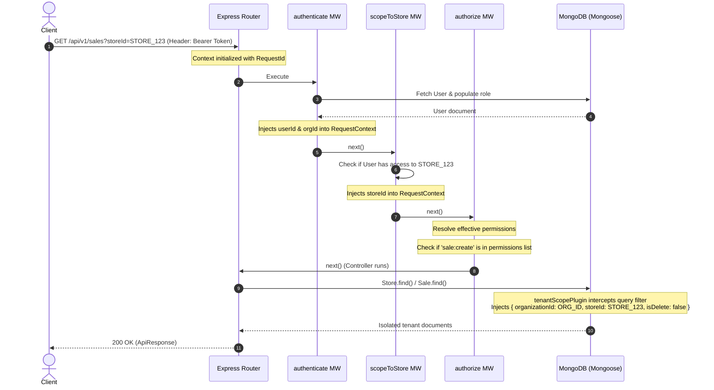

# SyncSale POS Backend - Development History & Architecture Log

This document tracks the initial setup phase, completed features, structural decisions, and configuration standards established in the codebase so far.

---

## 📅 Project Setup & Configuration

- **TypeScript Foundation:** Initialized typescript compiler using standard strict settings (`tsconfig.json`) targeting `ES2022` with CommonJS module generation.
- **Path Aliasing:** Configured `@/*` mapped to `src/*` to avoid deeply nested relative imports (e.g., `import X from "../../../utils"`).
- **Formatters and Linters:** Configured ESLint (`eslint.config.mts`) and Prettier (`.prettierrc`, `.prettierignore`) for codebase consistency.

---

## ⚙️ Environment Configuration (`src/config/env.config.ts`)

- **Strict Validation (Zod):** Implemented schema-based validation for all incoming `process.env` properties. The server will fail to startup and output detailed error logs if variables are missing or misconfigured.
- **Dynamic Loading:** Loads environment files based on the active `NODE_ENV`:
  - `test` ➡️ `.env.test.local`
  - `development` ➡️ `.env.development.local`
  - `production` ➡️ `.env`
- **Key Parameters Validated:**
  - `PORT`, `NODE_ENV` (Enforced enum: development/production/test)
  - `MONGO_URI` (Must be a valid URL format)
  - `JWT_ACCESS_SECRET` & `JWT_REFRESH_SECRET` (Strict minimum length of 32 characters enforced; must be different secrets)
  - `CORS_ORIGIN`, `API_VERSION`
  - Feature Flags (`FEATURE_MULTI_CURRENCY`, `FEATURE_ADVANCED_TAX_RULES`)
  - Logging level (`LOG_LEVEL`, `LOG_TO_FILE`)

---

## 🗄️ Database Layer (`src/config/db.config.ts` & `src/models/`)

- **Mongoose MongoDB Connection:**
  - Configured listeners on the connection pool (`connected`, `error`, `disconnected`).
  - Connection options tailored for POS environments: `autoIndex: false` in production (prevents latency spikes due to index rebuilds), `serverSelectionTimeoutMS: 5000` (fail fast if DB is down), and `socketTimeoutMS: 45000` (keeps sockets alive).
- **User Model (`src/models/user.model.ts`):**
  - **Roles Enum (`UserRole`):** Defines `SUPER_ADMIN`, `STORE_ADMIN`, `MANAGER`, `CASHIER`, `INVENTORY_MANAGER`, and `ACCOUNTANT`.
  - **PIN Password Format:** Custom Mongoose validation enforces numeric-only passwords (PIN style) for `SUPER_ADMIN` and `STORE_ADMIN` roles, while allowing standard passwords for cashiers/managers.
  - **Security Hooks:** Pre-save middleware automatically hashes passwords using `bcryptjs`.
  - **JWT Generation Instance Methods:**
    - `generateAccessToken()`: Encodes `id`, `email`, `role`, and `storeId` (for multi-tenant scoping if not SUPER_ADMIN).
    - `generateRefreshToken()`: Encodes user `id` for session renewal.
  - **Output Scoping:** Automatic JSON serialization transform strips sensitive fields like `password` and `__v` from results.

---

## 🪵 Structured Logging & Context Correlation

- **Correlation ID Middleware (`src/middleware/requestId.middleware.ts`):**
  - Generates or forwards a unique `X-Request-Id` UUID for each incoming request.
  - Stores this ID inside a Node `AsyncLocalStorage` context block (`src/utils/requestContext.ts`).
- **Winston Custom Logger (`src/config/logger.config.ts`):**
  - Reads active request contexts dynamically and injects the `requestId` into all Winston metadata logs.
  - **Development Mode:** Outputs human-readable, colorized terminal logs detailing timestamp, log level, request ID (if active), messages, and stack traces.
  - **Production Mode:** Outputs structured single-line JSON logs to feed aggregation tools (like Datadog/ELK).
  - **File Rotation Logging:** If `LOG_TO_FILE=true`, records `combined.log` (10MB limit) and `error.log` (5MB limit) in the local `/logs` directory, retaining the 5 most recent files.
- **Morgan HTTP Traffic Logger (`src/middleware/requestLogger.middleware.ts`):**
  - Intercepts incoming HTTP requests and pipes access descriptions (method, path, status code, response time) directly through Winston.

---

## 🛡️ Security & Route Architecture (`src/app.ts`)

- **HTTP Protection:** Embedded **Helmet** to block common injection vectors by configuring security headers.
- **CORS Config:** Configured dynamic origin mapping checking against the validated environment origins.
- **Payload Limits:** Restricted JSON and urlencoded body parsers to `10mb` max limits to prevent buffer overload DoS attacks.
- **Barrel Routing Structure:** Versioned endpoint management via `src/routes/v1/index.ts`.
- **Infrastructure Health Checks:** A non-versioned, lightweight `/health` route reporting uptime, environment, and system diagnostics for monitors/load balancers.

---

## ⚠️ Centralized Error Handling (`src/middleware/errorHandler.middleware.ts`)

- **Standardized Utilities (`src/utils/`):**
  - `ApiError`: Extends base Error to track HTTP status codes, validation errors, and custom messages.
  - `ApiResponse`: Utility for wrapping JSON payloads consistently (`statusCode`, `data`, `message`, `success`).
  - `asyncHandler`: Eliminates boilerplated `try/catch` wrappers around Express controllers.
- **Failsafe Global Handler:**
  - Catches route failures, JSON parsing crashes, mongoose cast/validation issues, and duplicate key errors.
  - Sanitizes stack trace information so development details are not leaked in production mode.

---

## 🔑 Dynamic RBAC & Multi-Tenancy Architecture

We transitioned the backend from basic static role enumerations to a **Dynamic RBAC (Role-Based Access Control) & Multi-Tenant SaaS** design. This allows tenants (Organizations) to define, configure, and modify their own roles and permissions dynamically without changing code.

### 1. Architecture & Design Decisions
- **Static Vocabulary:** Action permissions (e.g., `sale:create`, `product:delete`) are defined in code as a fixed permission catalog. Developers write checks against these keys.
- **Dynamic Configuration:** Roles are stored in the database. Their scopes and permissions arrays can be edited per organization dynamically.
- **Tenant Separation:** Core data isolation ensures data cannot leak between tenants (Organizations) and sub-tenants (Stores) automatically.

---

### 2. Component-by-Component Walkthrough

#### 📂 Part 1: The Permission Catalog (`permissions.catalog.ts`)
Defines the absolute vocabulary of actions inside the platform.
- **PermissionKey:** Union type of all valid system operations.
- **PermissionDefinition:** Structured catalog with category-scoped keys:
  - **Sales:** `sale:create`, `sale:void`, `sale:refund`
  - **Catalog:** `product:create`, `product:read`, `product:update`, `product:delete`
  - **Inventory:** `inventory:adjust`, `inventory:transfer`
  - **Reports:** `report:view_store`, `report:view_org`
  - **Admin:** `user:invite`, `user:manage_roles`, `role:manage`, `store:create`, `store:configure`, `organization:configure`
- **Type Guard:** `isValidPermission(key: string): key is PermissionKey` is exported to reject invalid permissions at the database validation layer.

#### 📂 Part 2: Database Models (with Tenant Scoping & Soft Delete)

- **Organization Model (`organization.model.ts`):**
  - Represents a corporate tenant.
  - Features a unique lowercase `slug` (indexed for subdomain routing), validation for `contactEmail`, tenant status control (`isActive`), and settings configuration (e.g., default currency, timezone).
- **Store Model (`store.model.ts`):**
  - Represents physical store locations under an Organization.
  - References `organizationId` and holds fields like `code` (e.g., `STR-001`), `address`, and `timezone`.
  - Implements a compound unique index on `{ organizationId: 1, code: 1 }` ensuring store codes are unique per organization, while letting different tenants reuse codes.
- **Role Model (`role.model.ts`):**
  - Stores dynamic permissions arrays.
  - References `organizationId` (nullable for platform-wide roles).
  - Scope options: `platform`, `organization`, or `store`.
  - Protects system defaults from deletion via `isSystemRole` flag.
  - Implements a compound unique index on `{ organizationId: 1, slug: 1 }` to guarantee unique roles within the tenant workspace.
- **User Model (`user.model.ts`):**
  - References `organizationId` with a scoped unique index on `{ organizationId: 1, email: 1 }` allowing users to reuse their emails across different organizations.
  - Keeps credentials secure by marking `passwordHash` as `select: false`.
  - Maps to an organization role (`orgRoleId`) and an array of store-specific roles (`storeAccess: Array<{ storeId, roleId }>`).
  - Stores SHA-256 hashes of `refreshTokens` (with IP & UserAgent) to secure refresh flows at rest.
  - Includes a platform operator flag `isSuperAdmin` to bypass RBAC checks entirely.

#### 📂 Part 3: Tenant Scoping & Soft Delete Plugin (`tenantScope.plugin.ts`)
Serves as an automatic defense-in-depth isolation boundary at the database driver level.
- **Auto-Injection:** Injects `isDelete`, `organizationId`, and `storeId` schema paths dynamically.
- **Scoping Hooks:** Intercepts Mongoose query methods (like `find`, `findOne`, `countDocuments`, `update`, `delete`).
- **Context Enforcer:** Reads tenant IDs from `AsyncLocalStorage` and automatically overlays them on active queries.
- **Soft Delete filter:** Automatically appends `{ isDelete: { $ne: true } }` unless explicitly overridden.
- **Migration/Seed Bypass:** Disables filters gracefully if request context is unavailable (e.g., during startup seed runs).

#### 📂 Part 4: Token Authentication Service (`auth.service.ts`)
- **generateAccessToken(payload):** Signs short-lived access JWTs containing `userId`, `organizationId`, and `isSuperAdmin`.
- **generateRefreshToken():** Generates cryptographically secure, opaque random tokens, returning the raw token to the client and storing a secure SHA-256 hash in the database.
- **verifyAccessToken(token):** Verifies access token signatures and throws standard 401 `ApiError` instances on expired or malformed tokens.

#### 📂 Part 5: Effective Permissions Resolution (`permission.service.ts`)
- **getEffectivePermissions(user, storeId):** Computes the union of org-level permissions and active store-level permissions based on request context. Returns `['*']` for Super Admins.
- **canGrantRole(grantorPerms, grantorScope, targetRole):** Prevents privilege escalation. Grantors cannot create or assign roles with higher scopes, or assign permissions they do not possess.

#### 📂 Part 6: Authorization Middleware Chain (`rbac.middleware.ts`)
- **authenticate:** Resolves `Authorization` headers, verifies access, and binds `userId`/`organizationId` in AsyncLocalStorage.
- **scopeToStore:** Resolves `storeId` from parameters, body, or query. Verifies user access, then injects `storeId` into the active context.
- **authorize(permission):** Evaluates dynamic permissions against the current user/store context, checking for either exact permission key matches or the wildcard (`*`) bypass.

#### 📂 Part 7: Default Roles Provisioning (`roleSeed.service.ts`)
Seeds default templates automatically on tenant creation:
- `org_admin`: All organization and store-level scopes.
- `store_manager`: Sales, inventory adjustment, and catalog management.
- `cashier`: Basic checkout (`sale:create`, `product:read`, `report:view_store`).
- `accountant`: Organizational finances (`report:view_org`, `sale:refund`).
- `inventory_clerk`: Catalog reading and inventory adjustments.

---

### 3. How Multi-Tenant Context Flows
The sequence diagram below displays how the authentication, context bindings, and database drivers interact when a request is made:



---

### 4. Linting and Type Safety Adjustments
We eliminated the use of the `any` keyword in the implementation by:
1. **Namespace Merging (`types/express.d.ts`):** Extended the Express Request interface to merge type-safe `user?: UserDocument` and context keys.
2. **Error Narrowing:** Refactored catches to type-check `error instanceof Error` before accessing properties.
3. **Mongoose Populated Casts:** Handled populated schema fields using safe narrowing checks (e.g., `'scope' in orgRole` property guard) instead of casting as `any`.

---

## 👑 Platform-Level Super Admin Authentication System

We implemented a secure, end-to-end Super Admin Authentication System designed to manage platform-level administrators separately from tenant-level users (like managers, cashiers, and org admins). This guarantees platform operators can manage the system globally without contaminating multi-tenant data boundaries.

### 1. Database Schema & Data Layer Security (`src/models/user.model.ts`)
We established strict boundary layers directly in the database:
- **Conditional Organization Scoping:** Super Admins span all organizations. We updated the `IUser` interface to support a `null` `organizationId` and configured a conditional validation function in Mongoose:
  ```typescript
  organizationId: {
    type: Schema.Types.ObjectId,
    ref: "Organization",
    required: function (this: any) {
      return !this.isSuperAdmin; // Only required for tenant accounts
    }
  }
  ```
- **Tenant Exclusivity Hook (Defense-in-Depth):** Added a schema-level `pre("validate")` hook that rejects saving user documents if both `isSuperAdmin: true` and `organizationId` are present. This prevents tenant-to-platform privilege escalation.
- **Partial Compound Indexing Strategy:**
  - MongoDB's default compound unique index on `{ organizationId: 1, email: 1 }` fails when multiple users have a `null` organizationId (since only one document can have a null value).
  - Reconfigured this to a partial index: `{ organizationId: 1, email: 1 }` filtered to `{ organizationId: { $gt: null } }`. This ignores platform accounts.
  - Added a second partial index: `{ email: 1 }` filtered to `{ isSuperAdmin: true }` to ensure all Super Admin email addresses are globally unique across the platform.

---

### 2. Strong Cryptographic Boundaries (JWT & Secrets)
To prevent cross-tenant key-compromise attacks (where a compromised tenant key might be used to sign a platform token), configurations are strictly isolated in `src/config/env.config.ts`:
- **Isolate JWT Platform Secret:** Signs and verifies Super Admin tokens exclusively using `JWT_PLATFORM_SECRET`. We added strict refinements checking that this platform secret does not match the tenant access or refresh secrets.
- **Tighter Expiry Configurations:** Platform tokens carry higher privilege, requiring shorter lifetimes:
  - Access Token expiry: `10m` (vs tenant `15m`).
  - Refresh Token expiry: `3d` (vs tenant `7d`).
- **Audience Claim Guard:** Super Admin access tokens are signed with the audience claim `{ aud: 'platform' }`. The platform verifier strictly asserts `aud === 'platform'`, ensuring tenant JWTs are rejected on platform routes.

---

### 3. Factorization of Shared Cryptography (`src/utils/token.util.ts`)
To keep our code DRY (Don't Repeat Yourself), we extracted cryptographic and helper logic from the existing tenant service into a unified utility file:
- `generateOpaqueToken()`: Generates a 40-byte hex-random plaintext token and returns both the plain string (for the client) and its SHA-256 hashed representation (for database storage).
- `hashToken()`: Reusable helper for SHA-256 token hashing.
- `getExpiryDate()`: Parses human-friendly time periods (e.g. `3d`, `10m`) into native JavaScript Date objects.
- Refactored the original `auth.service.ts` to consume these shared utilities, ensuring clean and reusable patterns.

---

### 4. Platform Authentication Middleware (`src/middleware/platformAuth.middleware.ts`)
Created a dedicated middleware for Super Admin authentication that operates in complete isolation from the tenant RBAC:
- Extracts and verifies bearer tokens using the platform secret (`JWT_PLATFORM_SECRET`).
- Re-validates the database state (`isSuperAdmin === true` and `isActive === true`) to catch real-time account deactivations.
- Binds user details to the request (`req.user`) and registers `userId` in the thread-safe `AsyncLocalStorage` Request Context.

---

### 5. Platform Controller, Validation & Routes
Built the controller layer (`src/controllers/platformAuth.controller.ts`) to manage authentication endpoints:
- **Anti-User Enumeration Login:** If a login fails, the controller catches the failure, logs the detailed breakdown internally via Winston, and returns a generic `401 Invalid credentials` to the client. This prevents attackers from finding valid admin emails by analyzing response differences.
- **Refresh Token Rotation (RTR):** Enforces single-use refresh tokens. When a session is refreshed, the old refresh token is revoked and a new pair is issued. Contains code documentation detailing how to handle token reuse attacks (terminating all active sessions if a previously-used token is presented again).
- **Logout Mechanics:** Supports logging out of a single device (by matching and removing the hashed token) or purging the entire `refreshTokens` subdocument array to log out of all devices.
- **Namespaced API:** Mounted the routes under `/api/v1/platform/auth/...` so it is isolated and clearly identifiable in routing trees.

---

### 6. CLI-Only Seeding Pathway (`src/scripts/seedSuperAdmin.ts`)
To enforce that Super Admin accounts are never created via public HTTP endpoints, we built a secure database initialization CLI script:
- Invoked via `npm run seed:super-admin`.
- Parses arguments (`--email`, `--password`), checks environment variables as a fallback, and uses interactive terminal prompting if variables are missing.
- Runs input checks against Zod schemas and saves the new administrator document directly to the database.

---

### 7. End-to-End Verification
- **Compilation & Formatting Check:** Ensured strict type compliance and verified linting rules.
- **Integration Test Suite (`testSuperAdminAuth.ts`):** Built a self-contained integration test environment starting a mock server on port `3999`. Runs 7 test cases covering:
  1. Successful Super Admin Login
  2. Input Validation Failure (Invalid email)
  3. Incorrect Password Attempt
  4. Access Token verification (Audience guard validation)
  5. Session Refresh rotation and RTR
  6. Logout (Session invalidation)
  7. Tenant Token rejection on Platform route
  All tests pass successfully.
